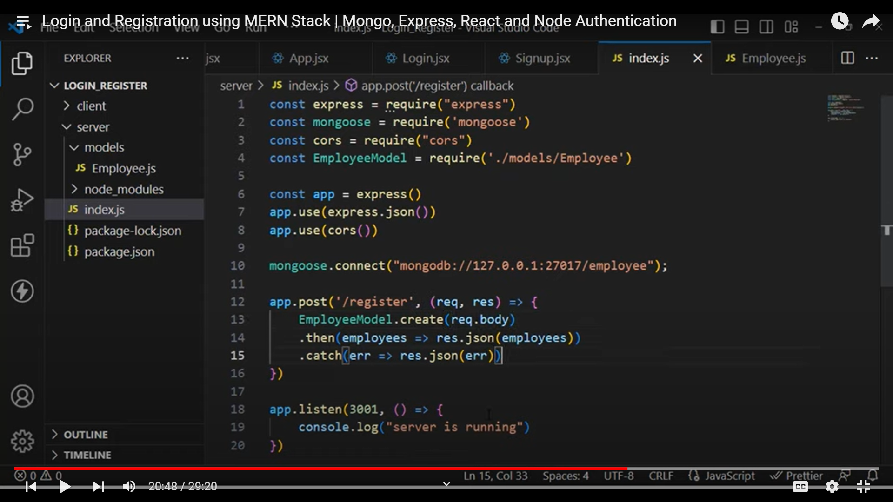

# Task-Bid-Hub
 Biding app

 install package 
        npm create vite@latest Task-Bid-Hub
        cd Task-Bid-Hub
        npm install


Start app
        cd Task-Bid-Hub
        npm run dev

Backend :

    create folder for backend 
    cd to that backend folder
    npm init -y

    The package is created in the folder 
    create one js file like server.js
    open that json package 
    change the "main" attribute value into this "server.js"

    *** same backend folder
    npm i express 
    npm i nodemon -D

    ****open that json package and inside of Scripts { }

    below of "test"

    "start":"node server",
    "dev":"nodemon server"

Mongodb connection using mongoose:

npm install mongoose
npm install mongodb




Model create panna :


Code for Model :

const mongoose=require('mongoose')

const userSchema=new mongoose.Schema({
    userName:String,
    email:String,
    passWord:String
})
const UserModel=mongoose.model('User',userSchema)
module.exports=UserModel


code for connectivity and post:


Environment variable mongodb connectivity

npm insatall dotenv
Front End:


# React + Vite

This template provides a minimal setup to get React working in Vite with HMR and some ESLint rules.

Currently, two official plugins are available:

- [@vitejs/plugin-react](https://github.com/vitejs/vite-plugin-react/blob/main/packages/plugin-react/README.md) uses [Babel](https://babeljs.io/) for Fast Refresh
- [@vitejs/plugin-react-swc](https://github.com/vitejs/vite-plugin-react-swc) uses [SWC](https://swc.rs/) for Fast Refresh


Login Page :
- sign-In-WithGoogle
- sign-In-With maild id password
- mobile Num

sign up :
- maild-id
- password

Profile Page:

full name
date of birth


Add Task

task name
task description
task date
task last date

npm install

```
npm install uuid
```
